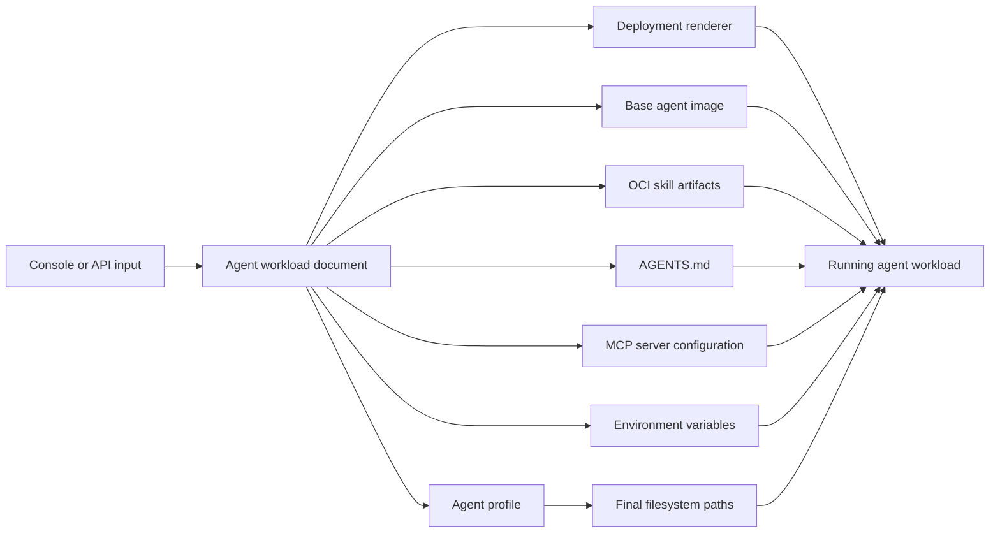
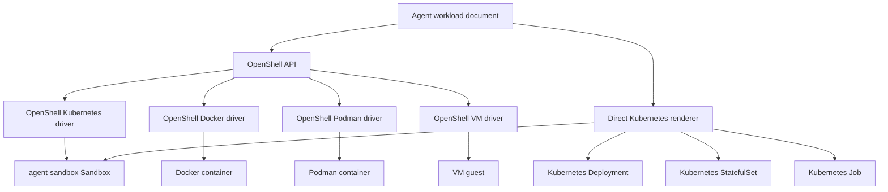
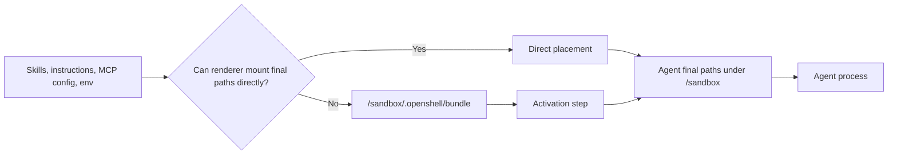
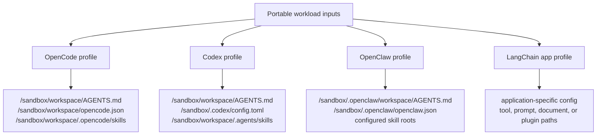

---
authors:
  - "@amfred"
state: draft
links: []
---

# RFC 0005 - Agent Image, Configuration, and Deployment Contract

## Summary

This RFC proposes a portable deployment-time contract for agent images, skills, generated or user-provided configuration, and workload rendering. The contract lets OpenShell-managed sandboxes and direct Kubernetes workloads use the same base agent images while materializing `AGENTS.md`, MCP configuration, environment variables, and skill artifacts at the paths expected by each agent runtime.

## Motivation and User Stories

Agent images are becoming a composition point for reusable skills, generated instructions, MCP server configuration, and deployment-specific environment. Today those concerns can be handled by baking more content into an image or by writing one-off manifests, but both approaches make it harder to reuse the same agent image across OpenShell-managed sandboxes and direct Kubernetes workloads.

This proposal defines a deployment-time contract for agent images, skills, generated or user-provided configuration, and workload rendering. The contract can be rendered by OpenShell or by a standalone Kubernetes manifest generator while the agent image keeps a stable `/sandbox` filesystem layout.

Key user stories:

- As a platform engineer, I want to select a base agent image and attach a set of skills without rebuilding that image.
- As an agent author, I want my agent to receive `AGENTS.md`, MCP configuration, and skill files at the paths my runtime expects.
- As an OpenShell user, I want the same deployment contract to work through `openshell sandbox create`.
- As a Kubernetes operator, I want to deploy the same agent image directly as a `Sandbox`, `Deployment`, `StatefulSet`, or `Job`.
- As a UI builder, I want a console where users choose skills, MCP servers, instructions, and environment variables, then render the result through either OpenShell or Kubernetes.
- As a security reviewer, I want generated secrets and mutable deployment configuration to stay separate from immutable skill artifacts and base images.

## Goals

- Standardize `/sandbox` as the home and workspace anchor for OpenShell-compatible agent images.
- Attach multiple OCI skill artifacts to one workload without rebuilding the base agent image.
- Support generated or user-provided `AGENTS.md`, MCP configuration, and environment variables without rebuilding the base agent image.
- Let agent profiles map the same portable workload inputs to OpenCode, OpenClaw, Codex, and LangChain-specific filesystem layouts.
- Support both OpenShell-managed sandboxes and direct Kubernetes manifests from the same deployment contract.
- Keep the base image portable across Kubernetes, Docker, Podman, and VM drivers.
- Preserve clear handling for sensitive data by separating non-sensitive deployment-provided content from Secret-backed content.

## Non-goals

- Define a universal skill format for every agent runtime.
- Require all agents to consume files directly from `/sandbox/.openshell/bundle`.
- Replace each agent's native configuration format, such as `opencode.json`, `/sandbox/.codex/config.toml`, or `/sandbox/.openclaw/openclaw.json`.
- Build a full OpenShell API schema in this RFC.
- Implement registry mirroring, signing, or admission-control policy for OCI skill artifacts.
- Require direct Kubernetes deployments to provide OpenShell policy enforcement, provider management, inference routing, or gateway lifecycle behavior.
- Support arbitrary home directories in the primary image contract.

## Context

Agent runtimes need a predictable filesystem layout that combines a base agent image, multiple independently versioned skill artifacts, per-agent configuration, environment variables, and a workload deployment target.

Consider an example agent that needs to consume three OCI artifacts that provide agent skills:

- `ghcr.io/example/skills/skill1:v1` contains `/skills/skill1`
- `ghcr.io/example/skills/skill2:v1` contains `/skills/skill2`
- `ghcr.io/example/skills/skill3:v1` contains `/skills/skill3`

Different agents expect skills, MCP configuration, instructions, and environment files in different locations. Because OpenShell controls the agent images, the runtime can simplify the contract by standardizing `/sandbox` as the `sandbox` user's home directory and the root for agent workspaces and OpenShell-managed runtime files.

The portable image contract is:

- `sandbox` user exists;
- `HOME=/sandbox`;
- `/sandbox/workspace` is the default project workspace;
- `/sandbox/.openshell/bundle` is the optional staging root for deployment-provided files.

When staging is needed, deployment-provided files should use this layout:

```text
/sandbox/.openshell/bundle/skills/skill1
/sandbox/.openshell/bundle/skills/skill2
/sandbox/.openshell/bundle/skills/skill3
```

When staging is used, deployment-provided instructions and MCP configuration should use this layout:

```text
/sandbox/.openshell/bundle/config/AGENTS.md
/sandbox/.openshell/bundle/config/mcp.json
```

This removes the need for renderers to discover or template an arbitrary agent home directory. Agent-specific profiles still choose final paths, but those paths should normally stay under `/sandbox`.

`AGENTS.md` comes from deployment-time agent instructions, either generated by tooling or provided by a user. MCP configuration comes from deployment-time MCP server selections and may contain sensitive endpoint or credential material. The workload contract treats MCP configuration as an abstract input; profiles decide whether the final representation is `mcp.json`, `opencode.json`, `/sandbox/.codex/config.toml`, `/sandbox/.openclaw/openclaw.json`, or an application-specific file.

The staging path is not the user-facing agent contract. Each agent profile should declare where that agent expects the files to appear, such as a repository root `AGENTS.md`, a Claude-style configuration directory, a Codex configuration directory, or an agent-specific skills path.

The same base agent container images should be usable in two deployment modes:

- through OpenShell, where users create sandboxes through the OpenShell API and the compute driver renders platform resources;
- directly on Kubernetes, where operators generate and apply [`agent-sandbox`](https://github.com/kubernetes-sigs/agent-sandbox/) `Sandbox` manifests, `Deployment`s, `StatefulSet`s, or `Job`s outside OpenShell.

Both modes should produce the same runtime filesystem contract for the agent. This keeps agent images portable and avoids a split where "OpenShell images" and "direct Kubernetes images" need different entrypoints, users, or directory layouts.

Kubernetes does not merge multiple volumes mounted at the same path. Mounting three OCI artifact volumes directly at a shared skills directory would cause mount conflicts or hide earlier mounts.

## Concept Diagrams

The deployment contract separates portable workload inputs from renderer-specific platform resources and agent-specific final paths.



The same workload document can be rendered by OpenShell-managed drivers or by a direct Kubernetes manifest generator.



Renderers can place files directly at profile-final paths when the platform can express those mounts, or stage inputs under `/sandbox/.openshell/bundle` and run activation.



Agent profiles map the same portable inputs to different native runtime conventions.



## Proposal

Define a portable agent workload contract and allow multiple deployment renderers to implement it.

The base agent image contract is:

- the image has a `sandbox` user with home directory `/sandbox`;
- the image sets or tolerates `HOME=/sandbox`;
- the image has or can create `/sandbox/workspace`;
- the image has or can create `/sandbox/.openshell/bundle`;
- the image can run a small activation step before starting the agent;
- deployment-specific files are not baked into the base image.

The deployment model is:

- one base agent image reference;
- one immutable OCI artifact reference per skill artifact;
- one generated or user-provided `AGENTS.md` payload;
- one generated or user-provided MCP server configuration payload;
- environment variables used to configure the agent;
- a sensitivity flag that determines whether deployment-provided files should be materialized as non-secret or secret runtime data;
- a sensitivity flag for each environment variable;
- an agent profile that declares final target paths and activation behavior.

Renderers should support two materialization strategies:

- **Direct placement:** mount deployment-provided files and skill artifacts directly at the final paths the selected agent expects.
- **Staging plus activation:** mount or copy deployment-provided files into `/sandbox/.openshell/bundle`, then run an activation step that copies, links, templates, or indexes those inputs into the selected agent's final locations.

Direct placement should be preferred when the renderer can safely express the final paths with volumes and `subPath` mounts. Staging plus activation is the portable fallback for agents that need path fan-out, generated indexes, file transformations, mutable config directories, or different layouts across runtimes.

On Kubernetes, the direct-manifest renderer maps the workload to:

- one Kubernetes image volume per immutable OCI skill artifact;
- one generated `ConfigMap` for non-sensitive deployment-provided files, starting with `AGENTS.md`;
- one generated `Secret` for sensitive deployment-provided files, including MCP configuration when it contains credentials, tokens, or private endpoints;
- workload-specific pod template mutations for `Sandbox`, `Deployment`, `StatefulSet`, and `Job` resources.

For profile-final direct placement, the renderer mounts each artifact or config file at the selected agent's final path. For example, an OpenCode profile can mount skills and config directly into the project workspace:

```yaml
volumeMounts:
- name: opencode-instructions
  mountPath: /sandbox/workspace/AGENTS.md
  subPath: AGENTS.md
  readOnly: true
- name: opencode-config
  mountPath: /sandbox/workspace/opencode.json
  subPath: opencode.json
  readOnly: true
- name: skill1
  mountPath: /sandbox/workspace/.opencode/skills/skill1
  subPath: skills/skill1
  readOnly: true
- name: skill2
  mountPath: /sandbox/workspace/.opencode/skills/skill2
  subPath: skills/skill2
  readOnly: true
- name: skill3
  mountPath: /sandbox/workspace/.opencode/skills/skill3
  subPath: skills/skill3
  readOnly: true
```

For staging plus activation, the renderer mounts files into `/sandbox/.openshell/bundle` and activation copies, links, templates, or indexes them into final profile paths:

```yaml
volumeMounts:
- name: agent-config
  mountPath: /sandbox/.openshell/bundle/config/AGENTS.md
  subPath: AGENTS.md
  readOnly: true
- name: agent-mcp
  mountPath: /sandbox/.openshell/bundle/config/mcp.json
  subPath: mcp.json
  readOnly: true
- name: skill1
  mountPath: /sandbox/.openshell/bundle/skills/skill1
  subPath: skills/skill1
  readOnly: true
```

The workload pod template declares the volumes. For `agent-sandbox` `Sandbox` resources, the pod template is under `spec.podTemplate`:

```yaml
spec:
  podTemplate:
    spec:
      runtimeClassName: kata
      volumes:
      - name: agent-config
        configMap:
          name: generated-agent-config
      - name: agent-mcp
        secret:
          secretName: generated-agent-mcp
      - name: skill1
        image:
          reference: ghcr.io/example/skills/skill1:v1
          pullPolicy: IfNotPresent
      - name: skill2
        image:
          reference: ghcr.io/example/skills/skill2:v1
          pullPolicy: IfNotPresent
      - name: skill3
        image:
          reference: ghcr.io/example/skills/skill3:v1
          pullPolicy: IfNotPresent
```

For built-in Kubernetes workloads, the same pod template content is rendered under `spec.template.spec` for `Deployment`, `StatefulSet`, and `Job` resources.

The manifest generation flow should produce the generated `ConfigMap`, generated `Secret`, and selected workload YAML as a single deployment unit immediately before applying it to the cluster.

If the selected agent profile requires staging plus activation, the renderer should also configure the activation step. On Kubernetes this can be an init container that writes to an `emptyDir`, or a container entrypoint wrapper that runs before the agent process. The same agent profile should work through OpenShell-managed deployment and direct Kubernetes manifests.

OpenShell should implement the same workload contract incrementally. The initial OpenShell integration can add agent workload metadata to `SandboxTemplate` or an adjacent API without changing the base image. The Kubernetes driver can then render that metadata into the same ConfigMap, Secret, image volumes, and volume mounts used by direct manifests. Other drivers can implement equivalent staging later through bind mounts, image mounts, or an init-copy fallback.

## Rationale

OCI artifacts are a good fit for skills because they are immutable, content-addressable, registry-native, and independently versioned. Operators can pin, promote, scan, and roll back skill artifacts using the same supply-chain controls already used for container images.

ConfigMaps and Secrets are a better fit for deployment-provided runtime configuration because their contents are specific to a particular workload deployment. Keeping `AGENTS.md` and MCP configuration outside the skill artifacts avoids rebuilding immutable skill artifacts for every deployment-time instruction or MCP configuration change.

Directly mounting each skill at its final child path avoids copying and preserves the read-only relationship between a mounted path and its OCI artifact. However, direct mounts are not always expressive enough for every agent. Staging plus activation provides a portable escape hatch when an agent needs its own filesystem layout or generated derived files.

Separating the workload contract from its renderer lets OpenShell adopt the feature in small steps. The API can first describe the image, configuration, skills, environment, and profile. The Kubernetes driver can render it. The supervisor does not need to own the files, and base agent images do not need to know whether they were launched by OpenShell or by a direct Kubernetes manifest.

Using the `Sandbox` CR in the Kubernetes renderer keeps OpenShell-style workloads aligned with the agent-sandbox controller lifecycle model: stable singleton identity, sandbox-specific lifecycle management, and compatibility with future Sandbox features. Supporting `Deployment`, `StatefulSet`, and `Job` renderers lets the same deployment model work for platform teams that need ordinary Kubernetes controllers instead of sandbox lifecycle management. Setting `runtimeClassName: kata` keeps the isolation decision in the pod template regardless of which workload controller owns the pod.

## Implementation plan

The proposal supports two first-class deployment modes that share the same base agent image.

### OpenShell-managed sandboxes

OpenShell currently accepts a public `SandboxTemplate` with image, runtime class, labels, annotations, environment, resources, volume claim templates, and user namespace settings. It does not expose arbitrary ConfigMap, Secret, or OCI image-volume mounts through the public sandbox create API.

To support this proposal incrementally, OpenShell should add a narrow agent workload surface rather than exposing the full Kubernetes pod volume API. The new surface should describe:

- the base agent image;
- skill OCI artifact references and optional digest pins;
- the generated or user-provided `AGENTS.md` content, or a reference to that content;
- generated or user-provided MCP server configuration, or a reference to that configuration;
- agent environment variables;
- whether each deployment-provided file is secret;
- whether each environment variable is secret;
- the selected agent profile and its final target paths;
- the selected materialization strategy, defaulting to direct placement when possible and staging plus activation when required.

The first implementation can be Kubernetes-only:

1. Extend the OpenShell API with agent workload metadata.
2. Validate file size, path, and secret-handling constraints in the gateway.
3. Persist the workload metadata with the sandbox spec.
4. Teach the Kubernetes driver to render workload metadata into a generated ConfigMap, generated Secret, OCI image volumes, volume mounts, and activation resources on the `agent-sandbox` `Sandbox`.
5. Keep the supervisor unchanged unless it needs to report activation status or expose workload diagnostics.

Later implementations can add equivalent staging for Docker, Podman, and VM drivers. Those drivers do not need to use Kubernetes image volumes; they only need to satisfy the same filesystem contract inside the agent image.

The OpenShell Kubernetes driver must compose this contract with its existing `/sandbox` workspace persistence behavior. Today the driver can mount a workspace PVC at `/sandbox` and seed it from the image by mounting the PVC at `/workspace-pvc` in an init container. Workload rendering must not replace or shadow that workspace mount. If final profile paths live under `/sandbox`, the renderer should either create parent directories in the persisted workspace before the main container starts, or run activation after workspace initialization. Direct `subPath` mounts into `/sandbox` must account for the fact that their parent directories need to exist on the workspace volume before the container starts.

### Direct Kubernetes manifests

Direct Kubernetes deployment remains a supported mode. A renderer outside OpenShell can generate:

- the `RuntimeClass` if the cluster does not already provide it;
- a ConfigMap for non-sensitive deployment-provided files;
- a Secret for sensitive deployment-provided files;
- one selected workload resource with the same image, mounts, environment, runtime class, and target paths.

This mode is useful for platform teams that already manage workloads through GitOps or custom Kubernetes tooling. It should not require an OpenShell gateway or OpenShell-specific image.

The renderer should support at least these Kubernetes workload targets:

| Target | Pod template location | Best fit |
|---|---|---|
| `agents.x-k8s.io` `Sandbox` | `spec.podTemplate` | OpenShell-style sandbox lifecycle and agent-sandbox controller integration. |
| `Deployment` | `spec.template` | Long-running stateless agents or services. |
| `StatefulSet` | `spec.template` | Agents that need stable identity, stable network names, or persistent volume claims. |
| `Job` | `spec.template` | One-shot agent tasks, migrations, evaluations, or batch runs. |

### Shared base image requirements

The base image is the common contract between the two deployment modes. It should:

- create the `sandbox` user with `/sandbox` as its home directory;
- set or tolerate `HOME=/sandbox`;
- include or be able to create `/sandbox/workspace` and `/sandbox/.openshell/bundle`;
- avoid baking deployment-provided `AGENTS.md`, MCP configuration, or deployment-specific skills into the image;
- start the agent through an activation-aware entrypoint, or support an init step that prepares the final paths before the agent starts;
- tolerate the staging directories being empty for minimal deployments.

OpenShell-managed and direct Kubernetes deployments can then select the same image reference. Only the deployment renderer changes.

### Current OpenShell image compatibility

Current OpenShell Community sandbox images are not supervisor images. They are agent/runtime images. For example, the community `base` image creates a `sandbox` user with `/sandbox` as its home directory, installs agent CLIs and development tools, copies the default sandbox policy to `/etc/openshell/policy.yaml`, copies image-baked skills under `/sandbox/.agents`, symlinks those skills into `/sandbox/.claude/skills`, and uses `/bin/bash` as its entrypoint. The current base image includes OpenCode and Codex CLIs. Other agents, such as OpenClaw or a LangChain application, can use the same workload contract but may require either a derived image or an activation step that installs or launches the selected runtime.

That means the images can be started outside OpenShell as ordinary containers for basic interactive or batch use. In that mode, OpenShell-specific files such as `/etc/openshell/policy.yaml` are inert unless an OpenShell supervisor or compatible launcher loads them. OpenShell policy enforcement, provider credential refresh, inference routing, gateway callback sessions, SSH relay, service forwarding, and dynamic policy/settings polling are not provided by the image alone.

When OpenShell launches the same image, the compute driver overrides the image entrypoint and starts the `openshell-sandbox` supervisor as root. The supervisor then prepares isolation and starts the requested agent command as the unprivileged `sandbox` user. This is why the same base image can be useful both outside OpenShell and inside OpenShell, but outside-OpenShell deployments should not assume OpenShell's security controls are active.

### OpenShell driver requirements

All OpenShell compute drivers should consume the same agent workload metadata and agent profile. The driver-specific work is only how the driver stages deployment-provided files and runs activation before the agent process starts.

Kubernetes: Render ConfigMaps, Secrets, image volumes, volume mounts, and optional init containers or entrypoint wrappers into the `agent-sandbox` `Sandbox` pod template. This is the first implementation target because Kubernetes can represent the full model declaratively.

Docker: Pull or resolve skill OCI artifacts, mount them read-only into the container or copy them into a driver-managed staging directory, write deployment-provided config files into a temporary host directory, mount that directory into the container, and run the activation step before the agent starts. Docker does not provide Kubernetes-style ConfigMaps or Secrets, so the driver must create short-lived host-side files with restrictive permissions and avoid persisting secret material beyond the sandbox lifetime.

Podman: Use Podman image mounts or driver-managed host staging for skill OCI artifacts, mount deployment-provided config files read-only, and run the activation step before the agent starts. Podman's native image-volume support may make direct placement closer to the Kubernetes model than Docker, but the driver still needs the same secret-file lifecycle controls.

VM: Fetch or receive skill OCI artifacts on the host, attach them as read-only mounts or copy them into the guest staging area, inject deployment-provided config through the VM driver's existing guest file/bootstrap path, and run activation inside the guest before the agent starts. VM support should preserve the same in-guest paths and agent profile behavior even though the host-side transport differs from containers.

The drivers do not need to share the same implementation mechanism. They need to produce the same in-runtime result:

1. the selected base image or guest rootfs starts;
2. deployment-provided files are available either at final target paths or in the staging directory;
3. sensitive deployment-provided files are readable only by the intended runtime user or supervisor path;
4. activation runs exactly once before the user-facing agent command;
5. the agent observes the paths declared by its profile.

This keeps the proposed container images portable. Images should not contain Docker-specific, Podman-specific, Kubernetes-specific, or VM-specific deployment logic. At most, they should contain an activation entrypoint that accepts a generic workload manifest path and applies the selected agent profile.

### What changes in each deployment mode

OpenShell-managed mode needs changes in OpenShell:

- add a portable agent workload API or `SandboxTemplate` extension;
- validate workload paths and file size limits at sandbox create time;
- store workload metadata with the sandbox spec;
- render Kubernetes workload resources in `openshell-driver-kubernetes`;
- add equivalent staging and activation support in Docker, Podman, and VM drivers;
- support agent profiles that map workload inputs to final agent-specific paths;
- support staging plus activation when direct mounts cannot satisfy the profile;
- optionally add lifecycle/status reporting for deployment-provided config resources.

Direct Kubernetes mode needs changes only in the manifest generator:

- generate ConfigMap and Secret resources before the workload manifest;
- generate one image volume and mount per skill artifact;
- render non-sensitive and sensitive environment variables into the workload pod template;
- apply the selected agent profile to choose direct final paths or staging paths;
- configure the activation step when staging is required;
- set `runtimeClassName: kata` in the selected workload pod template;
- materialize all files at the paths expected by the selected agent.

The base agent image needs a small durable contract, but it should not need per-mode variants. If the image already has the `sandbox` user, uses `/sandbox` as its home directory, and can create `/sandbox/workspace` plus `/sandbox/.openshell/bundle`, no image change is required.

## Console UI Requirements

This proposal supports a console-type user interface if the UI produces the same portable agent workload document instead of hand-authoring workload YAML directly.

The console should let users select or enter:

- a base agent image;
- a workload target such as OpenShell-managed sandbox, Kubernetes `Sandbox`, `Deployment`, `StatefulSet`, or `Job`;
- a runtime class such as `kata`;
- zero or more skill artifacts from a catalog of OCI references;
- zero or more MCP servers from a catalog;
- free-form `AGENTS.md` instructions;
- environment variables, with a per-variable sensitivity flag;
- an agent profile that declares where the selected agent expects instructions, MCP config, skills, and auxiliary files;
- optional resource, label, annotation, and scheduling settings.

The console then materializes those selections into an agent workload document. Renderers consume that document:

- the OpenShell renderer sends workload metadata through the OpenShell API once OpenShell supports the agent workload surface;
- the direct Kubernetes renderer emits ConfigMaps, Secrets, image volumes, mounts, env vars, and the selected workload resource.

MCP server selections should generate the profile-specific MCP configuration file. Non-sensitive MCP settings can be stored in a ConfigMap, while credentials, tokens, and private endpoint material should be stored in a Secret. Environment variables should follow the same split: non-sensitive values in a ConfigMap or inline workload env, sensitive values in a Secret referenced from `env` or `envFrom`.

This keeps the console UI independent of the deployment target. Users make the same choices; only the renderer changes.

## Concrete Agent Profiles

The proposal should ship with agent profiles for common agents. A profile is not a new image; it is a mapping from the portable workload model to the files, directories, environment variables, and startup behavior that a specific agent expects.

Each profile should declare:

- the working directory used when the agent starts;
- the instruction file or files generated from `AGENTS.md`;
- the MCP config format and final path;
- the skill root or conversion behavior;
- the environment variables that should be passed through directly;
- whether direct placement is allowed or staging plus activation is required.

### OpenCode

OpenCode supports project and global configuration. Project config is `opencode.json` at the project root, and OpenCode searches upward from the current directory to the nearest Git root. OpenCode skill discovery supports project-local `.opencode/skills/<name>/SKILL.md`, `.claude/skills/<name>/SKILL.md`, and `.agents/skills/<name>/SKILL.md`, plus global skill roots under `~/.config/opencode/skills`, `~/.claude/skills`, and `~/.agents/skills`. OpenCode also configures MCP servers through the `mcp` option in `opencode.json`. With `HOME=/sandbox`, those global roots resolve under `/sandbox`.

Profile behavior:

- Put generated operating instructions in a profile-selected project file, such as `AGENTS.md`, then reference that file from the `instructions` array in `opencode.json`.
- Materialize selected skills into `.opencode/skills/<skill>/SKILL.md` by direct placement when possible or by activation from staged OCI artifact content.
- Generate or patch `opencode.json` with selected MCP servers.
- Optionally generate OpenCode skill permissions so the UI can enable, deny, or require approval per selected skill.
- Put provider credentials in environment variables or secret-backed files referenced by the generated OpenCode config.
- Start the agent from the selected project root, for example with `opencode` or an explicit project-aware wrapper command.

This profile works well with either direct placement or staging plus activation. Staging is useful when a selected skill artifact contains a directory tree that must be normalized into OpenCode's `SKILL.md` layout.

### OpenClaw

OpenClaw is workspace-oriented. Its workspace is the primary working directory for file tools and context. With `HOME=/sandbox`, the default workspace resolves to `/sandbox/.openclaw/workspace`, while OpenClaw configuration, credentials, sessions, skills, and MCP server definitions live under `/sandbox/.openclaw/`.

OpenClaw expects standard workspace files such as `AGENTS.md` for operating instructions. OpenClaw skills can be loaded from `<workspace>/skills`, `<workspace>/.agents/skills`, `/sandbox/.agents/skills`, and `/sandbox/.openclaw/skills`, with additional skill roots configured under `skills.load.extraDirs` in `/sandbox/.openclaw/openclaw.json`. OpenClaw-owned outbound MCP server definitions are managed under `mcp.servers` in the same config family.

Profile behavior:

- Declare the OpenClaw workspace root, defaulting to `/sandbox/.openclaw/workspace` unless the selected image profile overrides it.
- Materialize generated instructions into `<workspace>/AGENTS.md`.
- Materialize selected skills into `<workspace>/.agents/skills/<skill>` or another configured skill root.
- Generate or patch `/sandbox/.openclaw/openclaw.json` with `skills.load.extraDirs`, per-agent skill allowlists, and `mcp.servers`.
- Put sandboxed skill environment variables into the sandbox runtime env, not only host-side OpenClaw config.
- Prefer staging plus activation when patching an existing OpenClaw config or when the profile must merge UI-selected skills with preexisting workspace skills.

The key design point is that OpenClaw should not require a separate base image. The profile captures where that specific OpenClaw runtime image expects files to land. If the selected OpenShell Community base image does not include OpenClaw, use a derived image that adds the OpenClaw runtime while preserving the same `sandbox` user and activation contract.

### Codex

Codex CLI reads configuration from `~/.codex/config.toml`; with `HOME=/sandbox`, that resolves to `/sandbox/.codex/config.toml`. Codex supports MCP server configuration in that TOML file. Codex also uses instructions from `AGENTS.md` and `AGENTS.override.md` in `$CODEX_HOME` and from project directories between the repository root and the current working directory.

Profile behavior:

- Materialize generated instructions into `AGENTS.md` at the selected repository or workspace root.
- Generate or patch `/sandbox/.codex/config.toml` with selected MCP servers under `mcp_servers`.
- Materialize selected skills into a Codex-readable instruction or skill location. If the selected Codex version does not have a native skill directory contract, activation should convert skills into referenced instruction files or repository-local guidance.
- Put provider credentials in environment variables or secret-backed files used by configured MCP servers.
- Set `CODEX_HOME=/sandbox/.codex` in direct manifests or when the image does not already use that location by default.

This profile should prefer staging plus activation because Codex configuration is usually user-home scoped while `AGENTS.md` is repository scoped.

### LangChain Agent

LangChain is a framework rather than a single CLI with one filesystem convention. A LangChain profile must be attached to a specific application image or launcher contract.

Profile behavior for a custom LangChain app:

- Declare the app's working directory and entrypoint.
- Generate a config file, such as `agent.yaml`, `agent.json`, or `.env`, at the path expected by that app.
- Materialize skill artifacts as tool prompt files, tool definitions, retriever documents, or Python package/plugin directories according to the app contract.
- Generate MCP server configuration only if the app includes an MCP client integration.
- Render non-sensitive app settings as environment variables and sensitive values through secret-backed env vars or files.
- Start the app through its normal entrypoint after activation has produced the expected files.

Profile behavior for LangChain Deep Agents Code-style images:

- Use the image's documented MCP config path, such as `.mcp.json` in the workspace.
- Materialize prompt and instruction files in the workspace path expected by the image.
- Treat skills as app-specific assets that activation converts into the image's configured tool or prompt layout.

The LangChain profile demonstrates why the proposal needs agent profiles rather than a single universal target directory. The workload input is portable, but the final files are application-specific.

### Profile Summary

| Agent | Best instruction target | MCP target | Skill target | Preferred materialization |
|---|---|---|---|---|
| OpenCode | Project `AGENTS.md` referenced by `opencode.json` | `opencode.json` `mcp` | `.opencode/skills/<name>/SKILL.md` | Direct placement or activation |
| OpenClaw | `<workspace>/AGENTS.md` | `/sandbox/.openclaw/openclaw.json` `mcp.servers` | `<workspace>/.agents/skills` or configured roots | Activation by default |
| Codex | Repository `AGENTS.md` and optionally `/sandbox/.codex/AGENTS.md` | `/sandbox/.codex/config.toml` `mcp_servers` | Codex skill support when available, otherwise generated instruction references | Activation by default |
| LangChain app | App-specific prompt/config file | App-specific MCP client config | App-specific tool, prompt, document, or plugin path | Activation by default |

## Risks and consequences

### Positive

- Agent images, skill artifacts, and deployment configuration can be versioned independently.
- Deployment-provided config can change per deployment without rebuilding skill OCI artifacts.
- Sensitive MCP config can be stored in a Kubernetes Secret instead of a ConfigMap.
- The running container gets the filesystem layout expected by the selected agent.
- The approach avoids a copy step and keeps skill contents read-only.
- The same base agent image can run through OpenShell or direct Kubernetes manifests.
- The same base agent image can run across OpenShell's Kubernetes, Docker, Podman, and VM drivers once each driver implements the workload renderer.
- Direct Kubernetes manifests can target `Sandbox`, `Deployment`, `StatefulSet`, or `Job`.
- A console UI can produce one workload document and render it through either deployment path.
- Staging plus activation can support agents with incompatible on-disk config conventions.

### Negative

- Direct placement requires the parent directories for final mount paths to exist in the runtime container image, or requires the renderer to create them through an init step.
- Staging plus activation adds startup complexity and can duplicate data into an `emptyDir` or writable layer.
- Copying sensitive deployment-provided files during activation increases the importance of file permissions, cleanup behavior, and avoiding persistent volumes for secret material.
- Kubernetes image volumes and image-volume `subPath` support must be available in the cluster and container runtime.
- `subPath` file mounts do not receive live updates from ConfigMaps or Secrets. Updating `AGENTS.md` or MCP configuration requires recreating or restarting the Sandbox pod.
- Each skill requires a separate volume and mount entry, so very large skill sets may need generated manifests rather than hand-written YAML.
- OpenShell needs new API and Kubernetes-driver support before `openshell sandbox create` can express the full workload model.
- Docker, Podman, and VM support require driver-specific artifact staging and secret-file lifecycle work even though the base image remains shared.
- Direct Kubernetes deployments bypass OpenShell provider, policy, and lifecycle management unless they explicitly integrate with an OpenShell gateway.
- Supporting multiple workload targets increases generator test coverage requirements because each target places the pod template in a slightly different location.

## Alternatives

### Mount all OCI artifacts at one shared skills directory

Rejected. Kubernetes does not merge multiple volumes mounted at the same path. Later mounts would hide earlier content or fail, depending on the exact mount configuration.

### Copy all skills into an `emptyDir` with an init container

This works and provides a true merged writable directory. It is now part of the staging plus activation fallback, but it is not the only supported materialization strategy because it adds startup work, duplicates data, and loses the direct read-only relationship between a final skill path and the OCI artifact volume.

This remains a valid fallback if the runtime needs to mutate skill files, generate indexes in place, or support clusters that cannot mount image volumes with `subPath`.

### Bake `AGENTS.md` and MCP configuration into the agent image

Rejected. These files are generated per deployment and may include environment-specific or sensitive configuration. Baking them into the image would require a new image build for every configuration change and would weaken secret handling.

### Bake all skills into the agent image

Rejected for the default path. A monolithic image is simpler to mount but couples skill versioning to the runtime image. That makes promotion, rollback, and per-agent skill selection more cumbersome.

### Expose raw Kubernetes volumes through the OpenShell API

Rejected for the initial OpenShell integration. A raw pod-volume API would be powerful, but it would leak Kubernetes-specific concepts into the portable sandbox API and would not translate cleanly to Docker, Podman, or VM drivers. A narrow agent workload API is easier to validate, document, and implement incrementally.

### Make direct Kubernetes manifests the only supported path

Rejected. Direct manifests are useful, but OpenShell-managed sandboxes need the same workload contract so users can keep using OpenShell lifecycle, provider, policy, observability, and connect flows.

### Support only `Sandbox` resources for direct Kubernetes

Rejected. `Sandbox` is the best fit for agent-sandbox controller integration, but platform teams also need ordinary Kubernetes controllers for stateless services, stable-state agents, and batch tasks. Because all four targets share the Kubernetes `PodTemplateSpec` shape, the workload renderer can support `Sandbox`, `Deployment`, `StatefulSet`, and `Job` without changing the base image contract.

## Operational Requirements

- The cluster must have the agent-sandbox CRDs and controller installed when rendering `agents.x-k8s.io` `Sandbox` resources.
- The cluster must provide a `RuntimeClass` named `kata` whose handler maps to the configured Kata Containers runtime.
- The cluster must support Kubernetes image volumes for OCI artifacts.
- For Kubernetes versions where image-volume `subPath` is not available, use the init-copy fallback.
- The agent image should include or allow creation of `/sandbox/workspace`, `/sandbox/.openshell/bundle`, and the selected final target directories.
- Agent profiles must constrain target paths to `/sandbox` or other explicitly approved prefixes.
- MCP configuration should be generated into a Secret whenever it contains sensitive data.
- OpenShell-managed deployments require an OpenShell release whose sandbox API and selected compute driver support the agent workload contract.
- Docker, Podman, and VM drivers must clean up generated secret files and staged artifacts when the sandbox is deleted.
- Direct Kubernetes deployments require a manifest renderer that can produce the ConfigMap, Secret, image-volume, and selected workload resources from the same workload inputs.
- The direct Kubernetes renderer must test pod-template rendering for `Sandbox`, `Deployment`, `StatefulSet`, and `Job`.

## Example

The sample manifests included with this RFC are in:

- `rfc/0005-agent-image-configuration-deployment-contract/sample-agent-runtimeclass.yaml`
- `rfc/0005-agent-image-configuration-deployment-contract/sample-agent-sandbox.yaml`

`sample-agent-sandbox.yaml` renders two concrete profile layout examples. The sample commands print the materialized paths and sleep so reviewers can inspect the filesystem; they intentionally do not start the real OpenCode or Codex agent process.

- `sample-opencode`, which materializes `AGENTS.md`, `opencode.json`, and selected skills into an OpenCode project workspace;
- `sample-codex`, which materializes `AGENTS.md`, `/sandbox/.codex/config.toml`, `CODEX_HOME`, and selected skills into a Codex workspace-compatible layout.

Apply order:

```shell
kubectl apply -f rfc/0005-agent-image-configuration-deployment-contract/sample-agent-runtimeclass.yaml
kubectl apply -f rfc/0005-agent-image-configuration-deployment-contract/sample-agent-sandbox.yaml
```

After the `sample-opencode` Sandbox pod is ready, the runtime should expose:

```text
/sandbox/workspace/AGENTS.md
/sandbox/workspace/opencode.json
/sandbox/workspace/.opencode/skills/skill1
/sandbox/workspace/.opencode/skills/skill2
/sandbox/workspace/.opencode/skills/skill3
```

After the `sample-codex` Sandbox pod is ready, the runtime should expose:

```text
/sandbox/workspace/AGENTS.md
/sandbox/.codex/config.toml
/sandbox/workspace/.agents/skills/skill1
/sandbox/workspace/.agents/skills/skill2
/sandbox/workspace/.agents/skills/skill3
```

## Open Questions

- Should skill artifact references be pinned by digest rather than mutable tags?
- Should deployment-provided config include a checksum annotation to force Sandbox pod recreation when `AGENTS.md` or MCP configuration changes?
- Should the generator support both direct image-volume mounts and the init-copy fallback?
- Should MCP configuration always be a Secret, even when it contains no sensitive values?

## Prior art and references

- Kubernetes image volumes: <https://kubernetes.io/docs/concepts/storage/volumes/#image>
- Kubernetes agent-sandbox project: <https://github.com/kubernetes-sigs/agent-sandbox/>
- OpenShell Community base sandbox image: <https://raw.githubusercontent.com/NVIDIA/OpenShell-Community/main/sandboxes/base/Dockerfile>
- OpenCode configuration: <https://opencode.ai/docs/config>
- OpenCode agent skills: <https://opencode.ai/docs/skills>
- OpenClaw workspace: <https://docs.openclaw.ai/agent-workspace>
- OpenClaw skills configuration: <https://docs.openclaw.ai/skills-config>
- OpenClaw MCP: <https://docs.openclaw.ai/cli/mcp>
- Codex MCP configuration: <https://developers.openai.com/learn/docs-mcp>
- Codex agent loop and instruction discovery: <https://openai.com/index/unrolling-the-codex-agent-loop/>
- LangChain MCP: <https://docs.langchain.com/oss/python/langchain/mcp>
- LangChain Deep Agents Code MCP tools: <https://docs.langchain.com/oss/python/deepagents/code/mcp-tools>
