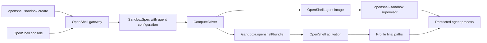

---
authors:
  - "@amfred"
state: draft
links: []
---

<!-- markdownlint-disable MD033 -->

<h1>RFC 0005 - OpenShell Agent Image Configuration Contract</h1>

<table>
  <tr>
    <th>Status</th>
    <td>Draft</td>
  </tr>
  <tr>
    <th>Author</th>
    <td><code>@amfred</code></td>
  </tr>
  <tr>
    <th>Scope</th>
    <td>OpenShell-managed sandboxes and OpenShell-compatible agent images</td>
  </tr>
  <tr>
    <th>Background</th>
    <td><a href="./CONTEXT.md">CONTEXT.md</a></td>
  </tr>
</table>

<h2>Summary</h2>

<p>This RFC proposes a contract for configuring agent images at sandbox creation time. The contract lets OpenShell attach skills, instructions, MCP configuration, and environment variables to OpenShell Community sandbox images without rebuilding those images for each agent, team, or workload.</p>

<p>The broader exploration that led to this RFC is preserved in <a href="./CONTEXT.md">CONTEXT.md</a>. This README narrows the proposal to OpenShell-managed sandboxes, OpenShell image conventions, and the project changes required inside OpenShell.</p>

<h2>Motivation</h2>

<p>OpenShell sandboxes run agent workloads through the gateway, compute drivers, and the <code>openshell-sandbox</code> supervisor. The current public sandbox creation flow can choose an image, pass environment variables, upload files, and run an agent command. That works for simple cases, but it does not provide a structured way to say: "run this OpenShell image with these skills, this <code>AGENTS.md</code>, this MCP configuration, and the path layout expected by this agent."</p>

<p>Today, teams can solve that by baking more content into custom images or by relying on one-off setup commands. Both approaches work against the OpenShell model. Images become harder to share, runtime configuration becomes less inspectable, and every agent runtime needs its own informal setup path.</p>

<p>OpenShell already owns the control plane and the sandbox launch path. That makes OpenShell the right place to define a narrow agent image configuration contract: users describe logical agent inputs, and OpenShell materializes those inputs inside an OpenShell-compatible image before the agent process starts.</p>

<h2>User Stories</h2>

<ul>
  <li>As an OpenShell user, I want to run <code>openshell sandbox create</code> with a base OpenShell image, selected skills, instructions, MCP configuration, and environment variables without rebuilding the image.</li>
  <li>As an OpenShell image maintainer, I want one image contract that works across the Kubernetes, Docker, Podman, and VM compute drivers.</li>
  <li>As an agent profile author, I want to map the same logical inputs to OpenCode, OpenClaw, Codex, or LangChain-specific filesystem locations.</li>
  <li>As a security reviewer, I want OpenShell to distinguish immutable skill artifacts, generated non-secret files, and secret-backed configuration.</li>
  <li>As a UI builder, I want an OpenShell API surface that can back a console where users choose skills, MCP servers, instructions, and environment variables.</li>
</ul>

<h2>Goals</h2>

<ul>
  <li>Define the runtime contract that applies to OpenShell-compatible agent images.</li>
  <li>Add an OpenShell API and CLI model for deployment-time agent configuration.</li>
  <li>Let OpenShell materialize selected skills, <code>AGENTS.md</code>, MCP configuration, and environment variables without rebuilding the base agent image.</li>
  <li>Keep agent-specific filesystem rules in OpenShell agent profiles rather than hard-coding them into every driver.</li>
  <li>Implement the same logical contract across Kubernetes, Docker, Podman, and VM compute drivers.</li>
  <li>Preserve the existing OpenShell security model: gateway-owned validation, driver-owned launch mechanics, supervisor-owned in-sandbox enforcement, and policy-controlled agent execution.</li>
</ul>

<h2>Non-Goals</h2>

<ul>
  <li>Define a generic Kubernetes manifest format for running agents.</li>
  <li>Replace each agent runtime's native configuration format.</li>
  <li>Define a universal skill package format for all agents.</li>
  <li>Make arbitrary third-party images first-class OpenShell images without requiring the OpenShell image contract.</li>
  <li>Change OpenShell provider, inference, policy, or gateway authorization semantics.</li>
  <li>Expose raw Kubernetes volume, <code>ConfigMap</code>, or <code>Secret</code> APIs through <code>openshell sandbox create</code>.</li>
</ul>

<h2>Current OpenShell Behavior</h2>

<p>OpenShell exposes a public sandbox creation model that includes image selection, command execution, environment variables, resources, labels, annotations, uploads, and driver-specific configuration. The gateway turns that public request into a <code>SandboxSpec</code> and dispatches a <code>DriverSandboxSpec</code> to the selected <code>ComputeDriver</code>.</p>

<p>The Kubernetes driver renders an Agent Sandbox <code>Sandbox</code> resource and pod template. The Docker, Podman, and VM drivers create equivalent local or guest execution environments. In all cases, the OpenShell supervisor starts inside the sandbox workload, applies runtime controls, and launches the requested agent command as the restricted agent process.</p>

<p>OpenShell Community images already behave like agent/runtime images rather than supervisor-only images. The base image creates a <code>sandbox</code> user, uses <code>/sandbox</code> as the home directory, includes common agent CLIs such as Codex and OpenCode, includes default OpenShell policy material, and supports being launched by OpenShell with an overridden entrypoint.</p>

<p>The missing piece is a structured OpenShell-owned configuration layer between "choose an image and command" and "the agent process starts."</p>

<h2>Proposed Contract</h2>

<h3>Image Contract</h3>

<p>An OpenShell-compatible agent image should satisfy this contract:</p>

<ul>
  <li>The image has a <code>sandbox</code> user.</li>
  <li>The <code>sandbox</code> user's home directory is <code>/sandbox</code>.</li>
  <li><code>HOME=/sandbox</code> is valid for the agent process.</li>
  <li><code>/sandbox/workspace</code> is the default workspace root.</li>
  <li><code>/sandbox/.openshell/bundle</code> is available as an OpenShell-managed staging root for deployment-time agent configuration.</li>
  <li>The image tolerates the compute driver overriding the image entrypoint to start <code>openshell-sandbox</code>.</li>
  <li>The image can run an OpenShell activation step before the final agent command starts.</li>
  <li>Deployment-specific skills, instructions, MCP configuration, and secrets are not baked into the base image.</li>
</ul>

<h3>API Contract</h3>

<p>The OpenShell API should describe logical agent configuration rather than low-level mounts:</p>

<ul>
  <li>selected OpenShell image;</li>
  <li>selected agent profile, such as <code>opencode</code>, <code>codex</code>, <code>openclaw</code>, or <code>langchain</code>;</li>
  <li>selected skills, each with an immutable source reference and optional name;</li>
  <li>generated or user-provided <code>AGENTS.md</code>;</li>
  <li>generated or user-provided MCP configuration;</li>
  <li>environment variables, with a sensitivity marker for secret values;</li>
  <li>optional activation behavior declared by the selected profile.</li>
</ul>

<p>The agent profile maps the logical inputs to the final filesystem layout expected by the agent. For example, a Codex profile might place instructions in <code>/sandbox/workspace/AGENTS.md</code>, map MCP settings into Codex's native configuration, and expose skills at the path Codex-compatible tooling expects. An OpenCode profile can use the same logical inputs but write an <code>opencode.json</code> file and skills directory layout appropriate for OpenCode.</p>

<h2>Materialization Model</h2>

<table>
  <tr>
    <th>Strategy</th>
    <th>Description</th>
    <th>Best fit</th>
  </tr>
  <tr>
    <td><strong>Direct placement</strong></td>
    <td>The driver places files or read-only artifact contents directly at the final paths declared by the selected agent profile.</td>
    <td>Simple profiles where the driver can safely express the final filesystem layout.</td>
  </tr>
  <tr>
    <td><strong>Staging plus activation</strong></td>
    <td>The driver places files under <code>/sandbox/.openshell/bundle</code>, then an OpenShell activation step copies, links, templates, indexes, or transforms those files into final profile paths.</td>
    <td>Profiles that need path fan-out, generated config files, skill indexes, mutable directories, or driver-independent fallback behavior.</td>
  </tr>
</table>

<p>The staging layout should be stable when used:</p>

```text
/sandbox/.openshell/bundle/skills/<skill-name>
/sandbox/.openshell/bundle/config/AGENTS.md
/sandbox/.openshell/bundle/config/mcp.json
/sandbox/.openshell/bundle/manifest.json
```

<p><code>manifest.json</code> should describe the selected profile, input files, skill sources, sensitivity metadata, and target paths. It gives the activation step a driver-independent description of what OpenShell intended to materialize.</p>

<h2>Conceptual Flow</h2>



<h2>Required OpenShell Changes</h2>

<table>
  <tr>
    <th>Area</th>
    <th>Change</th>
  </tr>
  <tr>
    <td><strong>Public API</strong></td>
    <td>Add a narrow agent configuration surface to the public sandbox model. This could be a new field on <code>SandboxTemplate</code>, an adjacent <code>AgentConfiguration</code> message referenced by <code>SandboxSpec</code>, or another OpenShell-owned API shape. The API should validate profile names, skill references, target path constraints, file sizes, secret markers, and unsupported combinations before dispatching to a driver.</td>
  </tr>
  <tr>
    <td><strong>CLI</strong></td>
    <td>Extend <code>openshell sandbox create</code> so users can provide agent configuration without hand-writing driver configuration. The CLI should also accept structured console-generated input that contains profile, skills, instructions, MCP servers, and environment variables.</td>
  </tr>
  <tr>
    <td><strong>Gateway</strong></td>
    <td>Normalize agent configuration into the sandbox record, reject invalid paths or oversized files, preserve secret classification, and pass a driver-facing representation through <code>DriverSandboxSpec</code> or an adjacent driver API.</td>
  </tr>
  <tr>
    <td><strong>Agent profiles</strong></td>
    <td>Introduce profile definitions for supported OpenShell images and agents. Profiles should be data-driven where possible, with code reserved for transformations that cannot be described as copy, symlink, template, or environment mapping operations.</td>
  </tr>
  <tr>
    <td><strong>Kubernetes driver</strong></td>
    <td>Render agent configuration into the Agent Sandbox <code>Sandbox</code> pod template used by OpenShell. The driver can use generated <code>ConfigMap</code>s, generated <code>Secret</code>s, OCI image volumes or equivalent artifact resolution, and init containers or activation commands when staging plus activation is required.</td>
  </tr>
  <tr>
    <td><strong>Docker and Podman drivers</strong></td>
    <td>Consume the same driver-facing model. These drivers should create driver-managed temporary directories with restrictive permissions, mount non-sensitive files read-only, handle secret files with lifecycle cleanup, and resolve skill artifacts either as read-only mounts or copied staging content.</td>
  </tr>
  <tr>
    <td><strong>VM driver</strong></td>
    <td>Inject the same agent configuration into the guest using the VM driver's existing bootstrap or file transfer path. The in-guest result should match the same <code>/sandbox</code> paths seen by container-based drivers.</td>
  </tr>
  <tr>
    <td><strong>Supervisor and images</strong></td>
    <td>Run activation before the requested agent command. OpenShell Community images should standardize on <code>/sandbox</code> as the user home and workspace anchor while keeping deployment-specific skills, MCP server selections, and user instructions outside the base image.</td>
  </tr>
  <tr>
    <td><strong>Documentation and tests</strong></td>
    <td>Document the new <code>openshell sandbox create</code> options, the image contract, and each supported profile. Test API validation, CLI parsing, profile mapping, driver rendering, secret handling, activation behavior, and cleanup.</td>
  </tr>
</table>

<h3>Example CLI Shape</h3>

```shell
openshell sandbox create \
  --from base \
  --agent-profile codex \
  --agent-instructions ./AGENTS.md \
  --mcp-config ./mcp.json \
  --skill ghcr.io/example/skills/python:v1 \
  --skill ghcr.io/example/skills/github:v1 \
  --env FOO=bar \
  --secret-env GITHUB_TOKEN=provider:github-token \
  -- codex
```

<h3>Initial Agent Profiles</h3>

<table>
  <tr>
    <th>Profile</th>
    <th>Expected behavior</th>
  </tr>
  <tr>
    <td><code>codex</code></td>
    <td>Materializes instructions, MCP configuration, and skills into Codex-compatible paths under <code>/sandbox</code>.</td>
  </tr>
  <tr>
    <td><code>opencode</code></td>
    <td>Materializes instructions, MCP configuration, and skills into OpenCode-compatible paths under <code>/sandbox</code>.</td>
  </tr>
  <tr>
    <td><code>openclaw</code></td>
    <td>Materializes instructions, MCP configuration, and skills into OpenClaw-compatible paths under <code>/sandbox</code>.</td>
  </tr>
  <tr>
    <td><code>langchain</code></td>
    <td>Materializes instructions, MCP configuration, and skills into application-defined paths declared by the image or profile.</td>
  </tr>
</table>

<h2>Security Considerations</h2>

<ul>
  <li>OpenShell must keep the distinction between non-sensitive configuration and secret material explicit.</li>
  <li><code>AGENTS.md</code> is often non-secret, but MCP configuration may include private endpoints, credentials, or token references.</li>
  <li>Environment variables should support a secret-backed path rather than forcing raw secret values into command history, logs, or durable sandbox records.</li>
  <li>Activation logs must not print secret contents.</li>
  <li>Generated bundle manifests should record that a secret exists and where it was materialized, but not the value.</li>
  <li>Driver-managed temporary files containing secrets should be deleted when the sandbox is deleted, and local drivers should create those files with restrictive permissions.</li>
  <li>Skill artifacts should be treated as code. This RFC does not define signing or trust policy, but OpenShell should preserve enough source metadata for future policy, audit, or admission checks.</li>
</ul>

<h2>Alternatives Considered</h2>

<details>
  <summary><strong>Bake configuration into images</strong></summary>
  <p>This keeps runtime launch simple but creates many near-duplicate images and makes user-specific instructions, MCP selections, and secrets hard to manage safely.</p>
</details>

<details>
  <summary><strong>Expose raw driver or Kubernetes configuration</strong></summary>
  <p>This is flexible but leaks driver details into the OpenShell user experience and makes Docker, Podman, VM, and Kubernetes behavior diverge.</p>
</details>

<details>
  <summary><strong>Require each agent command to bootstrap itself</strong></summary>
  <p>This avoids driver work but pushes OpenShell concerns into every agent runtime and makes security validation less consistent.</p>
</details>

<details>
  <summary><strong>Use only <code>/sandbox/.openshell/bundle</code> as the final contract</strong></summary>
  <p>This is simple for OpenShell but unrealistic for agents that already expect their own config files and skills directories. Profiles should hide that difference from users.</p>
</details>

<h2>Open Questions</h2>

<ul>
  <li>Should agent profiles be shipped in the OpenShell repository, the OpenShell Community image repository, or both?</li>
  <li>Should the activation helper live in <code>openshell-sandbox</code>, a separate binary, or the OpenShell Community images?</li>
  <li>How should OpenShell represent skill artifact trust, signatures, and provenance in the future?</li>
  <li>Which agent profile should be the first implementation target?</li>
  <li>Should <code>mcp.json</code> be a canonical logical input even when the selected profile renders it into another native format?</li>
</ul>
